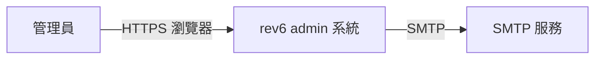

# C4-L1 系統脈絡

rev6 admin 後台的系統脈絡圖（C4 第一層）；同圖由 `docs/arc42/03-context-and-scope.md` §3.2 引用、不複製。E1 標註：目前無 AI 元件（截至 2026-09-03）、全圖為確定性區域；AI 元件進場時依 `C4-E1-ai-component-stereotypes.md` 的刻板型標註直接畫在本圖與 C4-L2 上。

| 節點 | 類型 | 說明 |
|---|---|---|
| 管理員 | 人 | 後台使用者；dev 帳號 Super／Admin／User（承 rev5 對照基準、CLAUDE.md §7） |
| rev6 admin 系統 | 本系統 | 前端 base-web＋後端 rust-api＋資料層；容器拓樸見 `C4-L2-container.md` |
| SMTP 服務 | 外部系統 | 寄信；dev＝mailpit 收信匣（容器內 SMTP 1025）、prod 為真 SMTP |
