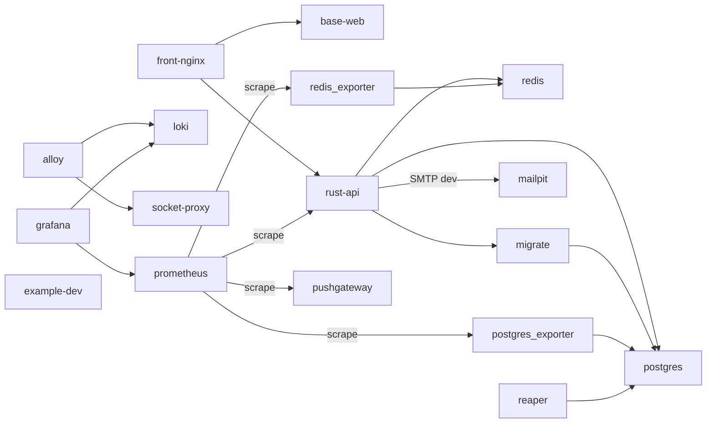

# C4-L2 容器視圖

dev stack 的容器拓樸（C4 第二層）；節點＝compose 三檔（`docker-compose.yml`／`.dev.yml`／`.example.yml`）的 17 個 service（GT-10 對賬：節點 ⊇ compose services），邊＝`depends_on`＋設定檔真源（prometheus scrape、grafana datasource、alloy→loki、dev SMTP）。host 埠不入本表、真表＝`docs/generated/reference/ports.md`（ADR-00001）。本圖零 AI 刻板型標註（目前無 AI 元件；C4-E1 規則隨 AI 功能刀啟用）。

| 服務 | 職責 | profile／檔 | 相依（邊） |
|---|---|---|---|
| front-nginx | TLS 終端與反向代理（nginx） | 預設 | → base-web、rust-api |
| base-web | 前端（soybean-admin fork、Vite dev） | 預設 | — |
| rust-api | 後端 API（Rust） | 預設 | → postgres、redis、migrate；dev → mailpit |
| migrate | 啟動閘：migration 容器（失敗則 rust-api 不啟） | 預設 | → postgres |
| postgres | 主庫 | 預設 | — |
| redis | 快取／會話 | 預設 | — |
| mailpit | dev 收信匣（SMTP 1025、UI 8025） | dev.yml | — |
| loki | 日誌庫 | obs | — |
| alloy | 日誌採集（docker service discovery） | obs | → loki、socket-proxy |
| socket-proxy | docker API 唯讀代理（alloy 非 root） | obs | — |
| grafana | 儀表板（datasource＝loki、prometheus） | obs、metrics | → loki、prometheus |
| prometheus | 指標庫（scrape 四目標） | metrics | → rust-api、postgres_exporter、redis_exporter、pushgateway |
| postgres_exporter | pg 指標 | metrics | → postgres |
| redis_exporter | redis 指標 | metrics | → redis |
| pushgateway | 批次指標接收 | metrics | — |
| reaper | 清理 job（最小權限 DB 身分） | jobs | → postgres |
| example-dev | soybean example 原版基線（對照用） | example.yml | — |
