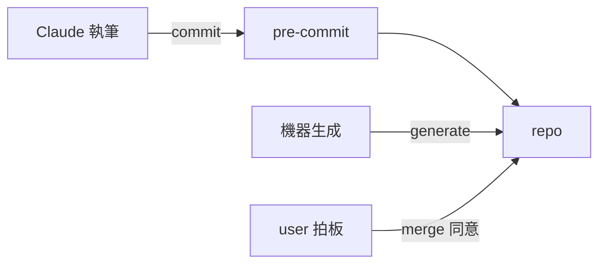

# P-C4-E3 材質邊界（流程層）

本檔以 RAD-AI C4-E3 的形制記載三材質即非確定性邊界：Claude 執筆／機器生成／user 拍板；信心＝lint 與 review、降級＝blocked／escalation、測試＝harness 十案；系統層對應＝`docs/c4/C4-E3-non-determinism-boundary.md`。每個子節首句標明類比張力（哪裡對得上、哪裡是硬套）。

### 邊界總覽

類比張力：對得上——三材質就是邊界：Claude 執筆（非確定性）、機器生成（確定性、由真源重算）、user 拍板（人在迴圈）；產物進入 repo 的每條路都經閘。

| 材質 | 確定性 | 進入 repo 的路 |
|---|---|---|
| Claude 執筆 | 非確定性 | 只經 pre-commit（機器閘）＋人審 |
| 機器生成 | 確定性（真源重算、GT-01） | generate 寫檔；禁手改 |
| user 拍板 | 人在迴圈 | AskUserQuestion 一題一問；merge 當次同意 |
| pre-commit | 機器閘 | betterleaks→check＋lint→工具自測 |
| repo | 確定性區域 | default branch `rev6-admin-root` |

### 邊界介面

類比張力：對得上——三種介面各有契約：檔案（人寫 vs generated、名冊 GENERATED_FILES 分家）、commit（pre-commit 全鏈）、AskUserQuestion（拍板級一題一問、選項 2～3、首選項為建議）。

### 信心門檻

類比張力：部分——無數值信心；門檻是三合一的布林：lint 全綠∧review 零 blocker∧人審同意；任一為假即不入 default branch。

### 降級行為

類比張力：對得上——agent 做不下去→`blocked` 主線接手；清單外待辦→`done_with_escalation`；script 不合規→hook 擋、零派發；豁免到期→閘紅（Day-1 解除謂詞）。

### 傳播規則

類比張力：對得上——非確定產物不得直接進 default branch（憲法 §I.8）；generated 永不手改（GT-01）；agent 絕不 push／merge／commit（RL-0063）；review 只讀（RL-0043）；每次越界（commit、merge）留痕於 git 與 events。

### 測試含意

類比張力：對得上——確定性側：docsync 自測（一正一反、變異打在判準上，RL-0051）、破壞性驗證還原（RL-0005）；非確定性側：harness-test 案例守編排骨架與 agent 回傳 schema；閘本身的變異紅證（RL-0029）。
