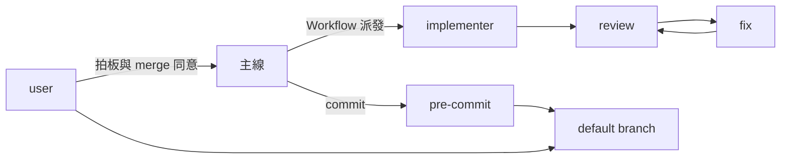

# P-E1 邊界劃定（流程層）

本檔以 RAD-AI E1 的形制記載開發流程中的 AI 代理（主線、implementer、review、fix、CDP 代理、三支 hook）與人審／機器閘的邊界；系統層對應＝`docs/arc42/03-context-and-scope.md` §3.3。每個子節首句標明類比張力（哪裡對得上、哪裡是硬套）。

### AI 元件清冊

類比張力：對得上——RAD-AI 的「AI 元件」在流程層＝會產出碼、文件或判斷的代理；三支 hook 與看門狗是確定性守門，列入清冊是為了畫出邊界、不是 AI 元件。

| 角色 | 承載 | 產物 | 進哪道閘 |
|---|---|---|---|
| 主線 | Claude Code session（本 repo 的執筆者） | commit、計畫檔、帳本條目、AskUserQuestion 提問 | pre-commit 全鏈（betterleaks→check＋lint）；人審（merge 同意） |
| implementer | Workflow agent（`*_OPTS` 之 IMPL） | 工作樹改動＋`{status, report}` 回傳 | spec-compliance review→fix；主線逐項 grep 復核、不採信回報 |
| review | Workflow agent（REVIEW；只讀） | findings（file×summary、blocker 集合） | 主線三分流（RL-0073）；不寫 repo 檔（RL-0043） |
| fix | Workflow agent（FIX） | 允許清單內的改動＋回傳 | 次輪 review 附前輪駁回清單（RL-0071）；迴圈上限 ≤3（RL-0060） |
| CDP 代理 | `tools/orchestration/cdp.mjs` 驅動的走查 agent | 走查回報（附機器反證，RL-0033） | 驗證審查；走查還原（RL-0031） |
| hook×3 | `.claude/hooks/`（session-start.sh、pre-workflow-gate.py、post-workflow-reminder.py）；確定性 | 健檢注入、擋缺 zh-TW／RULES-VERSION 之 script、配對提醒 | GT-09 接線對賬 |
| 看門狗 | `tools/wf-watchdog.py`；確定性 | stall／runaway 告警 | 與 Workflow 原子成對（RL-0061） |

### 系統邊界圖

類比張力：對得上——邊界＝人審與機器閘兩道；非確定性產物只能經這兩道進入 default branch（憲法 §I.8）。

| 節點 | 類型 | 說明 |
|---|---|---|
| user | 人 | 拍板級親決、merge／push 當次同意 |
| pre-commit | 機器閘 | betterleaks→docsync check（GT-01）＋lint（GT-01～GT-12）→staged 工具自測→entity-drift（pin bump／快照 staged 時條件實跑） |
| default branch | 確定性區域 | `rev6-admin-root`；只收經兩道閘的產物 |

### 四段邊界契約

類比張力：對得上——RAD-AI 要每個越界點標四項，流程層四項各有實物，差別在信心不是數值。

| 段 | RAD-AI 原意 | 流程層對應 |
|---|---|---|
| 輸出型 | 分類／連續／生成 | 生成型：報告、diff、findings；生成型的護欄＝規則塊烤入（`python3 tools/docsync rules emit`） |
| 信心規格 | 指標與門檻 | 非數值：lint 全綠＋review 零 blocker＋人審；agent 自報不算、事實接地附出處（RL-0028） |
| 換版頻率 | 排程／事件／連續／靜態 | 事件觸發：規則列改動→RULES-VERSION 變；換模＝改 `*_OPTS` 的一次 commit |
| fallback | 規則預設／快取／人工升級／降級／斷路 | 人工升級：`blocked` 立即回主線、`done_with_escalation` 帶升級項回（RL-0012）；斷路＝保險絲與 TaskStop（RL-0060／RL-0017） |

圖級同源＝`docs/c4/C4-E3-non-determinism-boundary.md` 邊界介面欄「三性質契約」（信心規格／fallback 策略／降級輪廓）；元件級四段與圖級三性質互指、不合併。

### 失效模式

類比張力：對得上——RAD-AI 列的失效模式在流程層都真實發生過（rev5 教訓），各有機器守。

| 失效 | 徵狀 | 守門 |
|---|---|---|
| hook 註冊斷裂 | 靜默放行（沒有錯誤就是最大的錯誤） | GT-09 接線與 exec bit 對賬；bootstrap hooks 指紋 |
| stall／runaway | 完成通知永不到；agent 數暴衝 | 看門狗（RL-0061／RL-0062）；保險絲常數自斷言 |
| 誤報成功 | agent 回報「完成」但工件不對 | 主線逐項 grep 復核；狀態欄不跨角色複用（RL-0004） |
| 規則塊過期 | script 烤入的 RULES-VERSION 與現算不符 | PreToolUse hook 對賬即擋 |
| 邊界侵蝕 | agent 改允許清單外的檔 | 清單寫死常數、清單外依 status 升級（RL-0022） |

### 外部 AI 依賴

類比張力：對得上——外部 AI 依賴就是託管模型與第三方 skill：無 SLA、換版由供應商決定。

| 依賴 | 形 | 影響面與對策 |
|---|---|---|
| Anthropic 託管模型 | model id 住 `*_OPTS`（名冊＝`docs/generated/reference/agents.md`） | 供應商換版＝行為可能變；對策＝規則烤入 prompt＋機器閘、不依賴模型記憶；換模＝一次 commit |
| 第三方 skills | `.claude/skills/`（第三方面、不受 rev6 掃描） | skill 改版影響流程形；skill 指示不覆蓋本 repo 規則（CLAUDE.md 優先） |
| upstream soybean-admin | 非 AI，但為 rebase 來源 | 軌道制（憲法 §III） |
